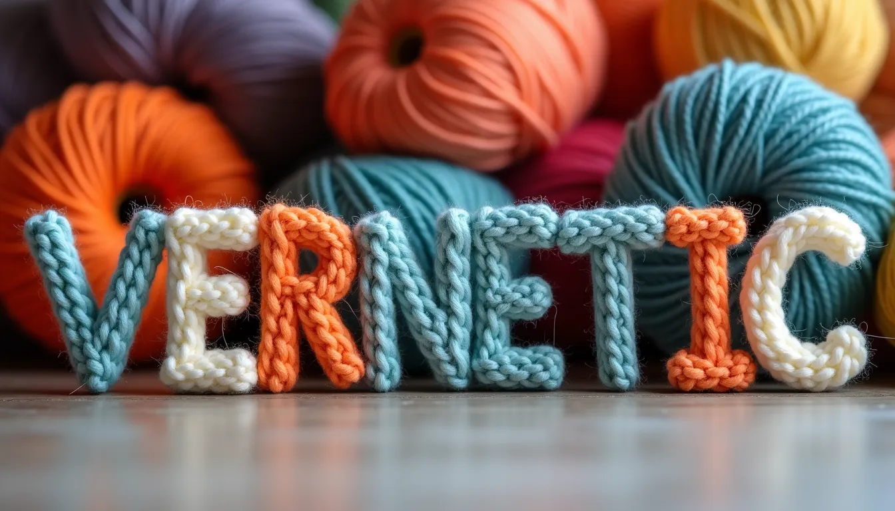

# Vernetic CSS Framework



Hey there!  
Welcome to the **Vernetic CSS Framework** — handcrafted since **2017**, open-sourced in the year of our nerd 2025, and finally, _finally_, with actual documentation.

If you've ever thought _"I wish I had a clean, modern, no-nonsense CSS framework I could actually read and extend without needing a PhD in utility class memorization"_, you’re in the right place.

> ✨ Vernetic is built with love, SASS, and stubborn refusal to use Bootstrap.

---

## GitHub Project

Clone it. Fork it. Star it. Brag about it.

**Repo:**  
[https://github.com/tompapatolis/vernetic](https://github.com/tompapatolis/vernetic)

```bash
git clone https://github.com/tompapatolis/vernetic
```

---

## Get Started

Add Vernetic to your page with a few simple tags.

### CSS

```html
<link rel="stylesheet" href="https://cdn.jsdelivr.net/gh/tompapatolis/vernetic@v7.0.7/dist/css/vernetic.css">
```

### JavaScript

Also in your `<head>` (with `defer`, because performance is cool):

```html
<script src="https://cdn.jsdelivr.net/gh/tompapatolis/vernetic@v7.0.7/dist/js/vernetic.js" defer></script>
```

### Icon Sprite

Anywhere in your `<body>`:

```html
<svg class="svg-icon">
  <use href="#box"></use>
</svg>
```

You can browse all available auto-loaded icons here:  
[https://syndesu.com/site/icons](https://syndesu.com/site/icons)

---

## Why Vernetic?

Because I needed a framework that:

- Didn’t fight me.
- Played nice with modern CSS.
- Wasn’t 1MB of opinionated bloat.
- And looked ✨ sharp ✨.

So I made it.

# >>> THE DOCUMENTATION IS FINALLY OUT! <<<

[👉 Check it out at vernetic.org](https://vernetic.org/)
